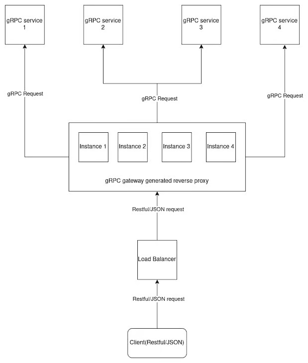
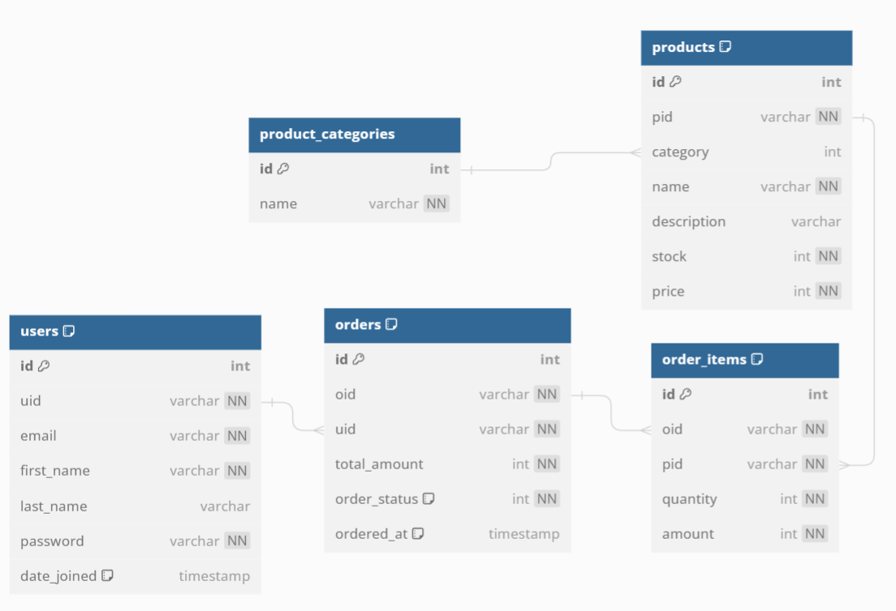
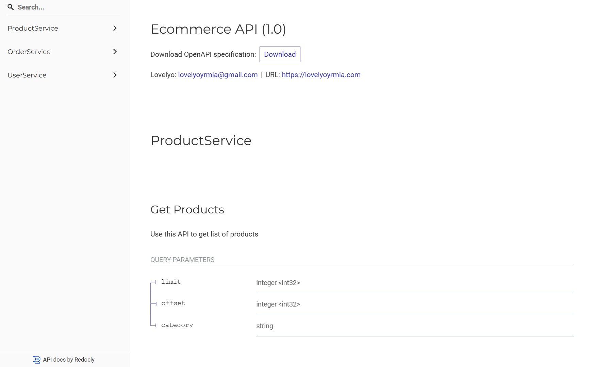

# Ecommerce Documentation

### Module : Go Version 1.21.6

### Server running on :
<a href="http://3.27.14.107:50052">Production</a>

This system is using GRPC and GRPC Gateway. The diagram below which explains how GRPC and gRPC Gateway work. 


source: https://blog.logrocket.com/guide-to-grpc-gateway/


## Tech Stack
[](https://www.microsoft.com/en-id/windows)  &nbsp;&nbsp;  [](https://www.linux.org/) &nbsp;&nbsp; [](https://wiki.debian.org/InstallingDebianOn/Microsoft/Windows/SubsystemForLinux)

<code></code> &nbsp;&nbsp; 
<code></code> &nbsp;&nbsp; 
<code></code>
&nbsp;&nbsp; 
<code></code>

### Other Tools:
- <a href="https://github.com/kyleconroy/sqlc#installation">SQLC</a>
- <a href="https://www.dbml.org/cli/#installation">DBML</a>
- <a href="https://dbdocs.io/docs">DB DOCS</a>
- <a href="https://pkg.go.dev/github.com/golang/protobuf/protoc-gen-go">PROTOC</a>


This system is hosted on AWS EC2 and using github actions as a CI/CD Pipeline

## ERD Docs

Complete ERD Docs: 
<a href="https://dbdocs.io/lovelyoyrmia/Ecommerce">Link ERD</a>


## API Docs

This API Docs are built with Swagger and Redocs. To Access the API Docs can see the link below :
<a href="http://3.27.14.107:50052/docs">Link API Docs</a>

### Default Error Response
```
{
    "code": integer,
    "message": string
}
```

### Error Code
There are some error codes used below: 
- 13 : (Internal Error)
- 10 : (Aborted)
- 5  : (Not Found)
- 11 : (Out Of Range)
- 16 : (Unauthenticated)
- 6 : (Already Exists)

### Services:
- User Service (Login, Register)
- Order Service (Add To Cart, Get Cart Products, Delete Cart Product, Checkout Order)
- Product Service (Get Products, Get Products by Category, Get Product Details)

#### The Order Services can be accessed by authenticated user.  

Example:
- POST /api/v1/carts
```
HEADERS : {
    "Authorization": "Bearer {Token}"
}

BODY : {
    "pid": "5ab402c1-a469-427a-8e1a-d21d08d33338",
    "quantity": 10,
    "amount": 18286
}
```

#### The Product Services have some query parameters.

Example:
- To get list of products by category

Note that category params can be optional
```
GET /api/v1/products?category=Laptop
```
- To get list of products pagination

Note that limit and offset can be optional
```
GET /api/v1/products?limit=10&offset=2
```

## Get Started

To get started this API you need to setup infrastructure:

### Setup Infrastructre
- Run Postgresql in Docker
```
make postgres
```
- Create Database in Postgresql
```
make createdb
```
- Create New Migrations
```
make createmigrate
```
- Create New Migrations with specific name
```
make newmigration name={your migration name}
```
- Run Migrate Up 
```
make migrateup
```
- Run Migrate Down 
```
make migratedown
```

### Generate Code
- Generate SQL CRUD using SQLC 
```
make sqlc
```

- Generate Schema Database From DBML
```
make dbschema
```

- Generate Proto File to Golang Code
```
make proto
```

### Documentation
- Generate DB Docs
```
make dbdocs
```

### How To Run In Local Development
- Create Environment
```
app.env : for production
dev.env : for development
.env    : for mapping env
```
- Install All Packages
```
go mod tidy
```
OR
```
go mod download
```
- Run Seeder to generate dump products
```
make seed
```
- Run Server
```
make server
```